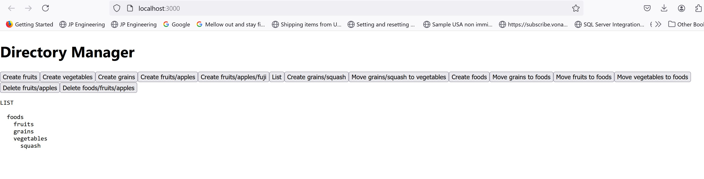

# Directory Manager Client

This project is a directory management client built with [Create React App](https://github.com/facebook/create-react-app).

## Available Scripts

In the project directory, you can run:
### `yarn`
### `yarn start`

Runs the app in the development mode.\
Open [http://localhost:3000](http://localhost:3000) to view it in the browser.

The page will reload if you make edits.\
You will also see any lint errors in the console.

### `yarn test`

Launches the test runner in the interactive watch mode.\
See the section about [running tests](https://facebook.github.io/create-react-app/docs/running-tests) for more information.

### `yarn build`

## Project Structure

- `public/`: Contains the public assets for the application.
    - `index.html`: The main HTML file.
    - `manifest.json`: The web app manifest.
    - `robots.txt`: The robots.txt file.
- `src/`: Contains the source code for the application.
    - `App.css`: The main CSS file for the App component.
    - `App.test.tsx`: The test file for the App component.
    - `App.tsx`: The main App component.
    - `index.css`: The global CSS file.
    - `index.tsx`: The main entry point for the React application.
    - `react-app-env.d.ts`: TypeScript environment definitions.
    - `reportWebVitals.ts`: Performance measuring utilities.
    - `services/`: Contains the API service files.
        - `api.ts`: API service functions like `createDirectory`, `deleteDirectory`, and `moveDirectory`.
    - `setupTests.ts`: Test setup file.
- `.gitignore`: Specifies files and directories to be ignored by Git.
- `package.json`: Contains the project dependencies and scripts.
- `tsconfig.json`: TypeScript configuration file.

## API Services

The project includes API service functions located in [`src/services/api.ts`](src/services/api.ts):
- [`createDirectory`](src/services/api.ts)
- [`deleteDirectory`](src/services/api.ts)
- [`moveDirectory`](src/services/api.ts)

## Output Example

Here is an example of the output:

